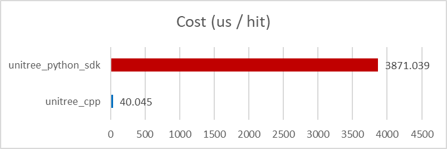

# Unitree Cpp
@GDDG80

<div align="center">



</div>

A lightweight Python binding for **Unitree SDK2**, designed to overcome the performance issues of the official `unitree_sdk2_python` on the **Unitree G1** (Jetson Orin).  

**FREE YOUR UNITREE G1 FROM THE ETHERNET CABLE!**

<div align="center">


</div>

## Inspiration

On Unitree G1, `unitree_sdk2_python` often suffers from serious performance issues, making it difficult to achieve real-time deploy with built-in Jetson pc2. 

Using `unitree_sdk2` directly avoids these performance problems, but C++ development and compilation can be cumbersome and time-consuming. 

This project provides the best of both worlds:  
- **Python interface** for simplicity and quick prototyping  
- **C++ backend** for high-frequency communication and efficiency  

As a result, you can write simple control code in Python, without dealing with the C++ compilation, while still ensuring real-time performance.


We tested the performance of `unitree_cpp` with [AMO](https://github.com/OpenTeleVision/AMO) on G1 pc2. The results are as follows:

<div align="center">

| Implementation      | Cost of control (μs/hit) |
|---------------------|---------------|
| `unitree_sdk2_python`  | 3871.039      |
| `unitree_cpp`          | 40.045        |

</div>

## Installation

### 1. Install Unitree SDK2

Follow the instructions on [Unitree SDK2](https://github.com/unitreerobotics/unitree_sdk2)  
to install the SDK2 on your system.  

**Note:** It is recommended to use the default installation path.  
If you choose a custom path, make sure to update `CMakeLists.txt` accordingly,  
so that the required libraries can be found.


### 2. Install `unitree_cpp` Python Binding

```bash
# switch to your python env
# tested on python>=3.8
pip install .
```

## Getting Started
Please refer to the example file: [`example/unitree_cpp_env.py`](example/unitree_cpp_env.py). 

Test the example with your robot:
- `pip install -r example/requirements.txt`
- change ethernet interface `eth_if` in [`example/config.py`](example/config.py)
- run the example
- your robot should move slowly into default position

This project supports:  
- **Unitree G1**  
- **Dex-3 hand**  
- **Odometry service**  

## License

CC-BY-4.0
